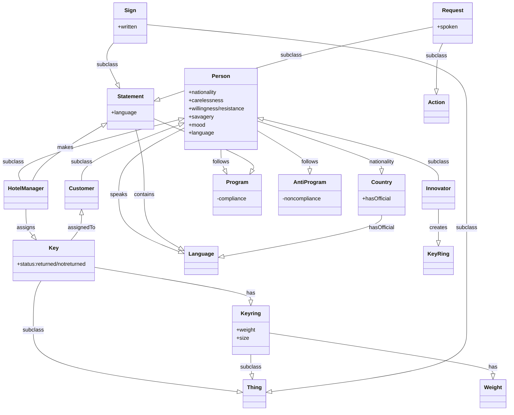

```mermaid
classDiagram
  Key --|> Thing : subclass
  Keyring --|> Thing : subclass
  Sign --|> Thing : subclass
  Person <|-- HotelManager : subclass
  Person <|-- Customer : subclass
  Person <|-- Innovator : subclass
  Sign --|> Statement : subclass
  Request --|> Statement : subclass
  Statement <|-- HotelManager : makes
  Person --|> Country : nationality
  Person --|> Language : speaks
  Statement --|> Language : contains
  Request --|> Action : subclass
  Country --|> Language : hasOfficial
  Key --|> Keyring : has
  Keyring --|> Weight : has
  HotelManager --|> Key : assigns
  Customer <|-- Key : assignedTo
  Person --|> Program : follows
  Person --|> AntiProgram : follows
  Statement --|> Program : communicates
  Innovator --|> KeyRing : creates
    class Thing{

  }
  class Language{

  }
  class Country{
    +hasOfficial

  }
  class Person{
    +nationality
    +carelessness
    +willingness/resistance
    +savagery
    +mood
    +language
  }
  class HotelManager{

  }
  class Innovator{

  }
  class Customer{

  }
  class Keyring{
    +weight
    +size
  }
  class Key{
    +status:returned/notreturned

  }
  class Sign{
    +written

  }
  class Weight{

  }
  class Statement{
    +language

  }
  class Request{
    +spoken

  }
  class Action {

  }
  class Program{
    -compliance

  }
  class AntiProgram{
    -noncompliance

  }


```

# Notes

- Why does he use the words _paradigmatic_ and _syntagmatic_ on page 108? What is the connection with ontologies? Is this something we can pull in?
-
